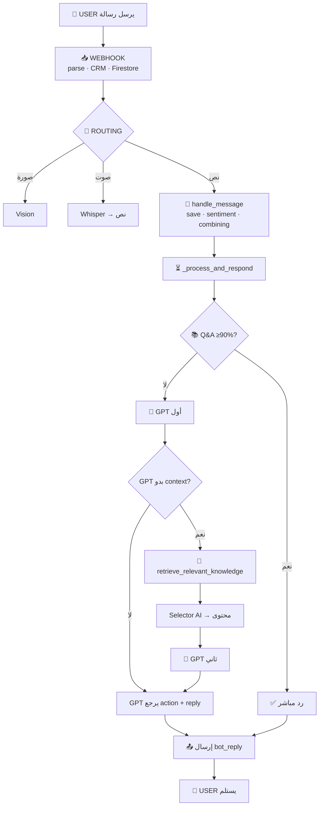

# مسار الرسالة من 0 للأخر – Lina's AI Bot

## خريطة المسار (Flow Map)



---

## مخطط نصي

```
0. USER يرسل رسالة
        ↓
1. WEBHOOK (parse, CRM, Firestore)
        ↓
2. ROUTING (صورة, صوت, نص)
        ↓
3. handle_message (save, sentiment, takeover check, combining)
        ↓
4. _process_and_respond (out-of-scope check)
        ↓
5. Q&A DATABASE (≥90% → رد مباشر | <90% → متابعة)
        ↓
6. GPT أول استدعاء (KB + Style + history)
        ↓
   ┌────┴────┐
   │         │
   ▼         ▼
لا tools   retrieve_relevant_knowledge
   │         │
   │         ▼
   │    7. Bot → Selector AI → Bot (محتوى)
   │         │
   │         ▼
   │    8. GPT ثاني (يستخدم المحتوى)
   │         │
   └────┬────┘
        ↓
9. تنفيذ action → إرسال bot_reply
        ↓
10. USER يستلم الرد
```

## ملخص

| المرحلة | من | إلى | مين يقرر |
|---------|-----|-----|----------|
| 0–3 | User | Bot | — |
| 4–5 | Bot | Q&A / GPT | Bot (يجرّب Q&A أولاً) |
| 6 | Bot | GPT | GPT (هل بدو context؟) |
| 7 | GPT | Bot | GPT (يطلب tool) |
| 7 | Bot | Selector AI | Bot (ينفذ) |
| 7 | Selector AI | Bot | Selector AI |
| 8 | Bot | GPT | GPT (يستخدم المحتوى) |
| 9 | GPT | Bot | GPT (action + bot_reply + handover) |
| 10 | Bot | User | Bot (ينفذ) |

**الخلاصة:** الـ AI (GPT + Selector) يقرر، البوت ينفذ. GPT يقرر متى نحوّل للبشري (handover_degree / human_handover).

---

## مسار الكود (Code Path)

| الخطوة | الملف | الدالة / المسار |
|--------|-------|------------------|
| 0 | WhatsApp | المستخدم يرسل رسالة |
| 1 | `modules/webhook_handlers.py` | `receive_webhook()` → `process_parsed_message()` → `adapter.parse_webhook_message()` (parse) → `resolve_customer_from_external()` (CRM) → `get_user_state_from_firestore()` (Firestore restore) |
| 2 | `modules/webhook_handlers.py` | `process_parsed_message()`: `image` → `handle_photo_message_whatsapp_with_adapter()` \| `audio` → `handle_voice_message_whatsapp_with_adapter()` \| نص → `handle_message_whatsapp_with_adapter()` _(/start و /train غير مستخدمين)_ |
| 3 | `handlers/text_handlers_message.py` | `handle_message()` → save to Firestore → `sentiment_service.analyze_sentiment()` → takeover check → `config.user_pending_messages` (combining) → `_delayed_process_messages()` |
| 4 | `handlers/text_handlers_delayed.py` → `handlers/text_handlers_respond.py` | `_delayed_process_messages()` → `_process_and_respond()` (out-of-scope check) |
| 5 | `handlers/text_handlers_respond.py` → `services/local_qa_service.py` | `find_match_with_tier()` → إذا ≥90% رد مباشر، وإلا متابعة لـ GPT |
| 6 | `handlers/text_handlers_respond.py` → `services/chat_response_service.py` | `get_bot_chat_response()` (KB + Style + history) |
| 7 | `services/chat_response_service.py` → `services/dynamic_retrieval_service.py` | tool `retrieve_relevant_knowledge` → `select_files_llm()` → يرجع المحتوى للـ GPT |
| 8 | `services/chat_response_service.py` | `get_bot_chat_response()` استدعاء ثاني مع tool result |
| 9 | `handlers/text_handlers_respond.py` | تنفيذ `action` → `send_message_func()` + `save_conversation_message_to_firestore()` |
| 10 | Adapter (MontyMobile/Dialog360/…) | `adapter.send_text_message()` → WhatsApp |
