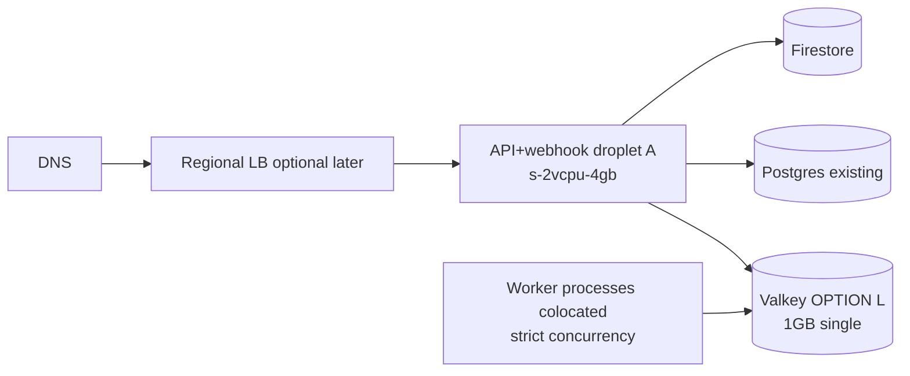
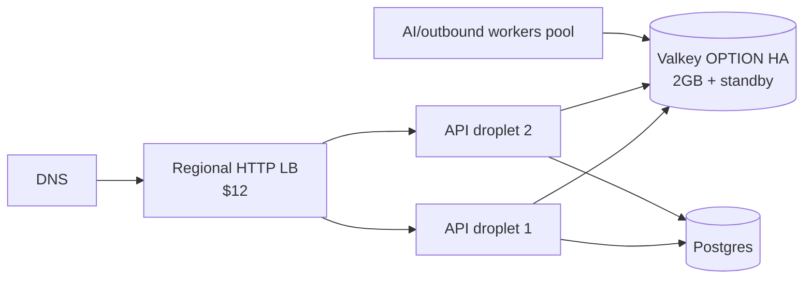

# DigitalOcean Scale Topology — Linas AI

**Date:** 2026-08-12  
**Region preference:** `lon1` (current Linas droplet)  
**Do not reuse:** `sportbook-redis-prod` (fra1)

## Pricing evidence (live / DO docs 2026)

| Resource | Source | Price |
|----------|--------|-------|
| Droplet `s-2vcpu-2gb-90gb-intel` | `doctl compute size list` | **$24/mo** |
| Droplet `s-2vcpu-4gb-120gb-intel` | doctl | **$32/mo** |
| Droplet `s-4vcpu-8gb` | doctl | **$48/mo** |
| Valkey `db-s-1vcpu-1gb` nodes=[1] only | `doctl databases options slugs` + DO pricing | **$15/mo** (OPTION L) |
| Valkey `db-s-1vcpu-2gb` nodes=[1,2,3] | doctl + DO pricing | **$30/mo per node**; HA min **2 nodes = $60/mo** (OPTION HA) |
| Regional HTTP LB | DO docs | **$12/mo per node** |
| Spaces | DO list pricing (if needed) | typically **$5/mo** base + storage/transfer |

**Valkey HA note:** Standby nodes require **≥2 GiB RAM** plans. `db-s-1vcpu-1gb` **cannot** add standbys.

---

## Lean topology (low launch cost, HA-*ready* code)

| Component | Spec | HA? | Mo cost |
|-----------|------|-----|---------|
| App compute | Keep/upgrade current lon1 droplet → prefer **s-2vcpu-4gb** | No (1 node) | ~$24–$32 |
| Workers | Colocated systemd `linasbot-worker@*` | Soft | $0 extra |
| Valkey | `linas-redis-prod` **db-s-1vcpu-1gb** ×1 lon1 | **No** | **$15** |
| LB | None initially | — | $0 |
| Postgres | Existing Linas PG | No | existing |
| Spaces | Only if media must leave local disk | — | $0–$5 |

**Lean monthly add-on (new):** ≈ **$15** Valkey (+ optional +$8 droplet upgrade).

Survives: process crash with restart. Does **not** survive droplet loss without restore.

---

## HA topology (recommended when HA matters + still cost-aware)

| Component | Spec | HA? | Mo cost |
|-----------|------|-----|---------|
| LB | Regional HTTP 1 node lon1 | Yes | **$12** |
| API compute | 2× `s-2vcpu-4gb` lon1 | Yes (N+1) | **$64** |
| Workers | Colocate on API nodes initially **or** 1× worker droplet | Partial | $0–$32 |
| Valkey | `db-s-1vcpu-2gb` **num-nodes=2** lon1 | **Yes** | **$60** |
| Postgres | Existing; plan managed HA later | Partial | existing |
| Spaces | If media shared | Yes | ~$5 |

**HA_LAUNCH_MONTHLY (new infra estimate):** ≈ **$12 + $64 + $60 = $136**/mo (+ Spaces/PG resize if needed).  
Cheaper HA variant: 2× `s-2vcpu-2gb` ($48) + LB ($12) + Valkey HA ($60) = **~$120**/mo (tighter RAM).

---

## Growth topology

Separate pools (autoscale independently):

1. API / webhook ingress  
2. AI workers  
3. Outbound Meta/WA workers  
4. Requests / notification workers  

Prefer **Droplet Autoscale Pools** first. Use **DOKS only** if measured ops/scaling complexity justifies it. Code remains K8s-ready (stateless, readiness, SIGTERM drain, env config).

## Upgrade triggers

| Trigger | Action |
|---------|--------|
| API p95 > 500ms or CPU > 70% 10m | Add API replica behind LB |
| Queue oldest age > 60s | Add AI/outbound workers |
| Valkey memory > 70% or evictions | Resize Valkey |
| Single-node Valkey incident intolerance | Move OPTION L → OPTION HA |
| Local media cross-node breaks | Add Spaces |
